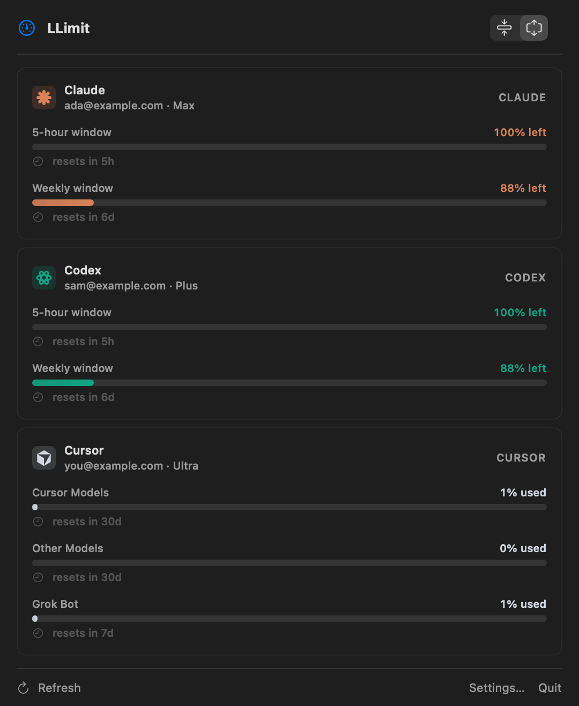

# LLimit

A native macOS menu-bar app that shows **how much of your Claude Code and
Codex usage windows you've burned through** — at a glance, across multiple
accounts, without leaving the keyboard.

<p align="center">
  
</p>

---

## Install

### One-line install (recommended)

```sh
curl -fsSL https://raw.githubusercontent.com/githajae/LLimit/main/install.sh | bash
```

Downloads the latest release, installs to `/Applications/LLimit.app`,
strips the macOS quarantine flag (so Gatekeeper doesn't block first launch),
and opens the app. Apple Silicon only for now.

### Manual install

1. Grab the latest `LLimit-<version>.zip` from the
   [Releases page](https://github.com/githajae/LLimit/releases).
2. Unzip and drag `LLimit.app` into `/Applications`.
3. The build is ad-hoc signed (no $99 Apple Developer account), so the first
   double-click will be blocked by Gatekeeper. Pick one:
   - **Right-click → Open → Open** in the dialog (older macOS).
   - **System Settings → Privacy & Security** → scroll to the LLimit
     message → **Open Anyway** (macOS 15+).
   - Terminal: `xattr -dr com.apple.quarantine /Applications/LLimit.app`

### Build from source

Requires macOS 14+ and Xcode 15 / Swift 5.9.

```sh
git clone https://github.com/githajae/LLimit.git
cd LLimit
Scripts/package_app.sh                  # → build/release/LLimit.app
open build/release/LLimit.app
```

For a versioned, zipped artifact:

```sh
Scripts/package_app.sh 0.2.0 zip        # → build/release/LLimit-0.2.0.zip
```

---

## Features

- **Live menu-bar icon** — two stacked progress bars (5-hour / weekly) plus an
  optional headline percent. Color escalates orange ≥70%, red ≥90%.
- **Multiple accounts at once** — list view up to 3 accounts, automatic
  2-column grid above that. Supports any mix of Claude and Codex configs.
- **Real plan-relative percentages**
  - Claude: calls `https://api.anthropic.com/api/oauth/usage` with your
    existing OAuth token (`5h`, `7d`, `7d opus`, `7d sonnet`).
  - Codex: queries the live usage API with each LLimit account's private credentials.
- **Identity at a glance** — surfaces email + plan tier (`max plan`,
  `plus plan`, …) under each account name.
- **Threshold notifications** — configurable warn-at percentage; one
  notification per window per reset cycle.
- **Launch at login** — toggle in General settings (uses
  `SMAppService.mainApp`).
- **Per-account login flow**
  - **Claude**: replicates the `claude login` PKCE OAuth flow ourselves —
    opens your real browser to Anthropic's sign-in page, catches the
    callback at `localhost:54545`, and saves each bearer to its own JSON
    snapshot. Bypasses the Claude CLI's single-global-keychain limitation
    so multiple accounts coexist.
  - **Codex**: launches `codex login` with an LLimit-owned, per-account
    `CODEX_HOME` and file credential storage. Sign-ins never write to the
    Codex app/CLI's default authentication directory.

---

## How it reads usage

| Provider | Source                                                                  |
| -------- | ----------------------------------------------------------------------- |
| Claude   | `GET https://api.anthropic.com/api/oauth/usage` with the OAuth token    |
| Codex    | `GET https://chatgpt.com/backend-api/codex/usage` with private per-account credentials |
| Auth     | Per-account JSON at `~/Library/Application Support/LLimit/credentials/<uuid>.json` (Claude) and `~/Library/Application Support/LLimit/codex/<uuid>/auth.json` (Codex) |

LLimit uses Anthropic and OpenAI authentication and usage endpoints.

---

## Releasing (maintainers)

```sh
Scripts/release.sh 0.2.0 "What's new in this release"
```

The script verifies a clean tree, builds a universal `.app`, ad-hoc signs it,
zips it, tags `v0.2.0`, pushes the tag, and uploads the zip via `gh release
create`. No notarization yet — users get a Gatekeeper warning on first launch.

---

## License

MIT — see [`LICENSE`](LICENSE).

### Isolated Codex sign-ins

Each LLimit Codex account owns `~/Library/Application Support/LLimit/codex/<account-uuid>/auth.json`.
Login, login status, and usage requests all use this private location. Login explicitly
uses the Codex CLI's file credential store. Renaming or reordering an account does not
change its authentication identity; switching accounts in the Codex app/CLI does not
replace LLimit's saved sign-in.

On upgrade, existing Codex auth files are copied once into private account directories
(mode 0700, auth files mode 0600). Original CLI files are left untouched. Existing
private sign-ins are never overwritten, and deleted credentials are not reimported.
New accounts sign in directly to private storage. If two legacy entries already
contained the same identity, sign in again to the intended account in LLimit; migration
cannot recover a previous identity. Imported OAuth sessions may still share server-side
revocation/refresh lifetime with the original session until signed in again in LLimit.

Validation: `swift test` and `bash Scripts/test_security.sh`.
